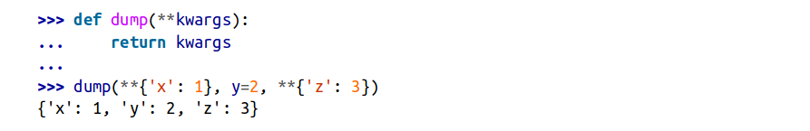
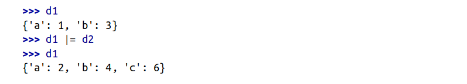
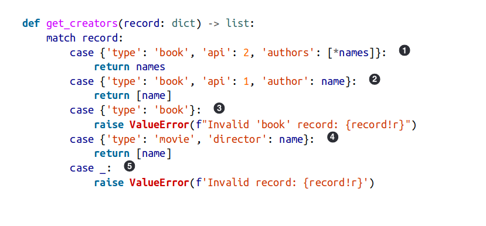
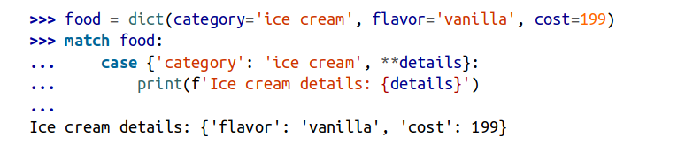
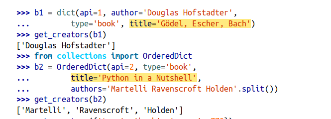
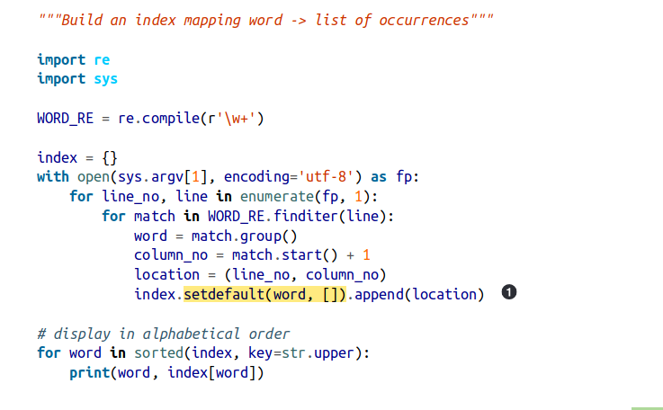
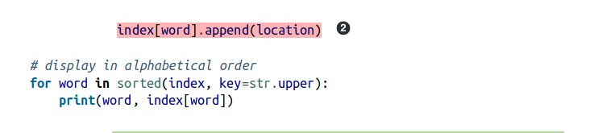

# Fluent
## Ditionaries and sets
- dict type is a fundamental part of Python’s implementation.
- The `__builtins__.__dict__` stores all built-in types, objects, and functions
- python dicts are highly optimized
- Hash tables are the engines behind Python’s high-performance dicts.
- The underlying implementation of dict and set still relies on **hash tables**
- ### Two important optimization of dict:
	- save memory
	- preserve the insertion order of the keys in dict

### Dict Comprehensions
a dictcomp builds a dict instance by taking key:value pairs from any iterable.

An iterable of key-value pairs like dial_codes can be passed directly to the dict constructor.


----
### Unpacking Mappings
- we can apply ** to more than one argument in a function call.
- This works when keys are all strings and unique across all arguments

- `**` can be used inside a dict literal—also multiple times
- duplicate keys are allowed. Later occurrences overwrite previous ones


### Mergin Mappings with |
- using `|` and `|=` to merge mappings.(union operators)
- Usually the type of the new mapping will be the same as the type of the left operand, but it can be the type of the second operand if user-defined types are involved.
- To update an existing mapping in place, use `|=`.




### Pattern matching with Mappings
- They can match instances of any actual or virtual subclass of **collections.abc.Mapping**.
- pattern matching is a powerful tool to process records structured like nested mappings and sequences, which we often need to read from JSON APIs and databases with semi-structured schemas
- 
- Note that the order of the keys in the patterns is irrelevant
- There is no need to use `**extra` to match extra key-value pairs, but if you want to capture them as a dict, you can prefix one variable with `**`. It must be the last in the pattern, and `**_` is forbidden because it would be redundant.


- In contrast with sequence patterns, mapping patterns succeed on **partial matches**.

- There is no need to use `**extra` to match extra key-value pairs, but if you want to capture them as a dict, you can prefix one variable with `**`. It must be the **last in the pattern**, and `**_` is forbidden because it would be redundant.

- we’ll study defaultdict and other mappings where key lookups via `__getitem__` (i.e., d[key]) succeed because missing items are created on the fly. 
- In the context of pattern matching, a match succeeds only if the subject already has the required keys at the top of the match statement.
---
### Standard API of Mapping Types
- collections.abc module provides the 
	- Mapping
	- MutableMapping ABCs 
describing the interfaces of dict and similar types. 
- main value of the ABCs is documenting and formalizing the standard interfaces.
- it’s easier to extend collections.UserDict instead of subclassing ABCs:
	The collections.UserDict class and all concrete mapping classes in the standard library encapsulate the basic dict in their implementation, which in turn is built on a hash table. Therefore, they all share the limitation that the keys must be hashable.

### What Is Hashable:
- An object is hashable if it has a hash code which never changes during its lifetime.
- Hashable objects which compare equal must have the same hash code.
- Numeric types and flat immutable types str and bytes are all hashable. Container types are hashable if they are immutable and all contained objects are also hashable. frozenset --> hashable
- User-defined types are hashable by default because their hash code is their id(), and the `__eq__()` method inherited from the object class simply compares the object IDs.
---
### Overview of Common Mapping Methods
- defaultdict and OrderedDict, both defined in the collections module.
- d.update(m) handles its first argument m is a prime example of duck typing:
	- m has a keys method  --> mapping
	- m doesn't have a keys method --> iterate over m assume items are (key, value) pairs
- setdefault --> a mapping method, avoid redundent key lookup when updating the value of an item
----
### Inserting or Updating Mutable Values
- d.get(k, default) is an alternative to d[k] whenever a default value is more convenient than handling KeyError
- code performs at least two searches for key—three if it’s not found—while setdefault does it all with a single lookup.

- The three lines dealing with occurrences can be replaced by a single line using dict.setdefault.
- setdefault --> Get the list of occurrences for word, or set it to [] if not found; setdefault returns the value, so it can be updated without requiring a second search

---
### Automatic Handling of Missing Keys
1) use a defaultdict
	
1) subclass dict or any other mapping tyoe and add a `__missing__` method.

#### defaultdict:
- collections.defaultdict instance creates items with a default value on demand whenever a missing key is searched using d[k] syntax.
- when instantiating a defaultdict, you provide a callable to produce a default value whenever __getitem__ is passed a nonexistent key argument. 
	1. Calls list() to create a new list. 
	2. Inserts the list into dd using 'new-key' as key. 
	3. Returns a reference to that list.
The callable that produces the default values is held in an instance attribute named default_factory.
- If no default_factory is provided, the usual KeyError is raised for missing keys.



- The default_factory of a defaultdict is only invoked to provide default values for `__getitem__` calls, and not for the other methods.

### The `__missing__` Method:
- This method is not defined in the base dict class, but dict is aware of it: if you subclass dict and provide a `__missing__` method, the standard dict.
- `__getitem__` will call it whenever a key is not found, instead of raising KeyError.

---

# Distilled (5.18 - 5.21)
## Decorators
>A decorator is a function that creates a wrapper around another function.
The primary purpose of this wrapping is to alter or enhance the behavior of
the object being wrapped.
```
@decorate
def func(x):
	...
```
>The preceding code is shorthand for the following:
```
def func(x):
	...

func = decorate(func)
```
---
### The @wraps Decorator
>In python, functions are objects containing some metadata such as the function name, doc string, and type hints. If you put a wrapper around a function, this information gets hidden. The `@wraps()` decorator copies various function metadata to the replacement function. The following example illustrates this issue:

code 1
```
def hello(func):
	def call(*args, **kwargs):
		print('Hello World!')
		return func(*args, **kwargs)
	return call

@hello
def djalal():
	print('djalal')

print(djalal.__name__)    # outputs call 
```
code 2
```
from functools import wraps

def hello(func):
	@wraps(func)
	def call(*args, **kwargs):
		print('Hello World!')
		return func(*args, **kwargs)
	return call

@hello
def djalal():
	print('djalal')

print(djalal.__name__)    # outputs djalal 
```
#### Note
>The order in which decorators appear might matter. For example, in class
definitions, decorators such as `@classmethod` and `@staticmethod` often have
to be placed at the outermost level.
---
### Decorator Factory
>Decorator factory is a function used to create decorators. The concept is best shown by an example:
```
def factory(msg):
	def decorate(func):
		def wrapper(*args, **kwargs):
			print(msg)
			return func(*args, **kwargs)
		return wrapper
	return decorate

@factory('Hello world!')
def foo1():
	print('foo 1')

@factory('Bye World!')
def foo2():
	print('foo 2')

>>> foo1()
Hello World!
foo 1

>>> foo2()
Bye World!
foo 2
```
---
## Map, Filter, and Reduce
### map
>Takes a function and an iterable as inputs and passes each element of the iterable through the function. General syntax for map is:
>`map(<function>, <iterable>)`
```
# example

>>> nums = [1, 2, 3]
>>> squares = map(lambda x: x**2, nums)

>>> for e in squares:
...	    print(e)
...
1
4
9
```
### filter
>The built-in `filter()` function creates a generator that filters values. General syntax for filter is:
>`filter(<function>, <iterable>)`
```
# example

>>> nums = [1, 2, 3, 4]
>>> odds = filter(lambda x: x&1, nums)

>>> for e in odds:
...     print(e)
...
1
3
```
### reduce
>In its general form, `reduce()` accepts a two-argument function, an
iterable, and an initial value, accumulates (reduces) the values and returns a single object as its output. General syntax for reduce is as below:
`reduce(<a two argument function>, <iterable>, <initial value>)`
```
# example
from functools import reduce

>>> nums = [1, 2, 3]
>>> product = reduce(lambda x, y: x*y, nums, 1)
>>> print(product)
6
```
---
## Function Introspection, Attributes, and Signatures
>As you have seen, functions are objects—which means they can be
assigned to variables, placed in data structures, and used in the same way as
any other kind of data in a program.
### inspect.signature
```
import inspect

>>> def func(x: int, y:float, debug=False) -> float:
...	    pass
...
>>> print(inspect.signature(func))
<Signature (x: int, y: float, debug=False) -> float>
```
---
## Stack Frame
>A function can obtain its own stack frame using `inspect.currentframe()`:
```
import inspect

def spam():
	f = inspect.currentframe()
	
```
> By doing so, we can access frame attributes listed in the following tabel.

| Atrribute | Description |
| --------- | ------------ |
| f.f_back | Previous stack frame (toward the caller)|
| f.f_code | Code object being executed |
| f.f_locals | Dictionary of local variables (locals()) |\
| f.f_globals | Dictionary used for global variables (globals()) |
| f.f_builtins | Dictionary used for built-in names |
| f.f_lineno | Line number |
| f.f_lasti | Current instruction. This is an index into the bytecode string of f_code. |
| f.f_trace | Function called at start of each source code line |
